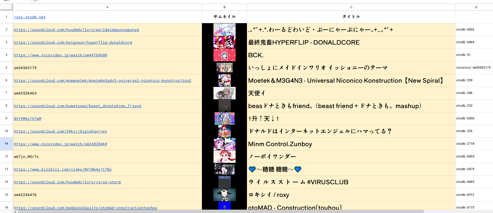

# 音MADのタイトルとサムネイルを透過的に取得する: [roxy.otodb.net](https://roxy.otodb.net) について

> [!NOTE]
> この記事は [音MAD Advent Calendar 2025](https://adventar.org/calendars/12426) の8日目の投稿として書かれたものです．執筆時の仕様などを書いたものなので，現状の実装とは乖離している可能性があります．正確な詳細は [README.md](../README.md) を参考にしてください．

## はじめに

こんにちは．SnO2WMaN ([Twitter][SnO2WMaN@Twitter], [GitHub][SnO2WMaN@GitHub]) と申します．

音MADを作っているわけではないのでこのアドベントカレンダーに参加するのは少し気が引けるのですが，普段は音MADのデータベースである [otoDB] の開発やモデレータなどをしたり，[音MADなどでDJをしたり](https://www.nicovideo.jp/user/118012640/series/515086)しています．

[otoDB]: https://otodb.net
[SnO2WMaN@Twitter]: https://x.com/SnO2WMaN
[SnO2WMaN@GitHub]: https://github.com/SnO2WMaN
[MADDRIFT2]: https://minamon.myportfolio.com/maddrift2

さて，そのような縁もあり，先日 [MADDRIFT2] というイベントで音MAD及びサンプリング音楽のDJをさせていただきました．
その際，イベントの出演者同士でセットリストが衝突しないようにGoogleスプレッドシートで管理することになり，owataxさんのnerdtronics2用のスプレッドシート[^owatax]を利用することになりました．

[^owatax]: [owatax, "nerdtronics2の振り返り③ (選曲管理/音MAD-mix監修) #ナートロ2"](https://owatax00.hatenablog.com/entry/2022/12/16/220025)

入力者側の手間を省くために，このスプレッドシートにはニコニコ動画のURLからタイトルをある自動で程度取得する機能があります．
ところが，例えば [MADDRIFT2の自分のパートのセットリスト](https://docs.google.com/spreadsheets/d/1uupTpF7A7RbZnftnLcoZ-ncAqOE-aSdcnBvL0duDrjc/edit?gid=1705056694#gid=1705056694) を見てほしいのですが，このスプレッドシートにはデバイス規制がかかっている動画に関してはタイトルが取得出来ないという問題があります．


さらに言えば，技術的な問題により，対応しているのはニコニコ動画のみであり，Youtubeの動画のタイトル取得には対応していないという問題があります．（画像の22行(No.18)を見なさい．）
欲を言えば，リンクのプレビューでサムネイルなどが表示されるとはいえ，スプレッドシート内で動画のサムネイルなども表示されてくれれば一覧性もあると思います．

まとめると，今後自分や他の人が何かしらこのような管理を行う際があるかもしれませんが，これでは多少不便だろうと思いました．

---

この問題を解決するために，[otoDB] のデータを上手く活用したプロキシをデプロイしました．以下このプロキシを単に _roxy_ と呼ぶことにします．

- エンドポイント: https://roxy.otodb.net （クエリを与えなければ単に下のGitHubのリポジトリにリダイレクトされるだけです）
- GitHubリポジトリ: https://github.com/otoDB/roxy

利用例は例えば次の画像のようになります．このスプレッドシートは [ここ](https://docs.google.com/spreadsheets/d/1a_P3bdOOKh7cOy6jwhB2ObHD_DrIIWC-2QwdnLqbawc?usp=sharing) から閲覧することも出来ます．



roxyでは次のことが可能です．
- 動画タイトルに加えてサムネイルと，roxy内でユニークなID(後述)を返却します．
- ある程度URLのクエリの曖昧さを許すようにしています．（`sm2057168`と`https://www.nicovideo.jp/watch/sm2057168`のどちらで入力しても良い）
- ニコニコ動画以外にもYoutube，Bilibili，SoundCloudに対応．

この記事では，そもそもotoDBが何かという説明を軽く述べた後，roxy の使い方と技術的詳細を説明します．

## otoDBについて

https://otodb.net/

[otoDB]は投稿プラットフォームを跨いでたくさん投稿されている音MAD及びYTPMVに対して，異なる言語間でも統一的にメタデータとしてタグ情報や作者情報などをつけることでデータベースを作る，という試みのために作られた，**音MADのデータベース**です．
主に [lachrymal](https://github.com/lachrymaLF) を中心として，自分を含めて複数の人物で開発を進め，何人かのモデレータによって動画の登録が行われています．
現在

<a href="https://otodb.net/work/random" target="__blank">otoDBに登録されているランダムな作品を見る</a>


[私にMADが舞い降りびゅ～と！](https://www.nicovideo.jp/watch/sm45476124)の関連作品のグラフ: https://otodb.net/work/4832/relations


現状のところ次のプラットフォームに投稿されている動画(音MAD)を取り扱っています．

- ニコニコ動画
- Youtube
- Bilibili
- SoundCloud

otoDBの開発動機はシンプルに言えば音MADをアーカイブする以上のことはないのですが，とはいえ，より突っ込んだ詳細や設計思想などについては，lachrymalと自分が以前に [『紙の音MAD Vol.1』](https://x.com/banfuture/status/1990381413838000429) の特集で色々話しているので，そちらも参照してください．

> [!IMPORTANT]
> 現在はアルファ版であり，招待された人物によって使用感などを確かめてたり必要な機能の洗い出しを進めている段階です．
**今年中には**ベータ版のリリースを予定としています．ベータ版でどのような機能が解放されるかは，今後のお知らせを参照ください．


## 使い方

roxyはとりあえずのところGoogleスプレッドシートでの利用を想定しているため，XMLを返す機能があります．

XMLを出力するエンドポイント: https://roxy.otodb.net/xml

`q` パラメータでクエリを入力します．
例えば，執筆時現在，https://roxy.otodb.net/xml?q=sm42246476 の出力結果は以下の通りです．

```xml
<data>
	<query>
		<platform>Niconico</platform>
		<id>sm42246476</id>
	</query>
	<url>https://www.nicovideo.jp/watch/sm42246476</url>
	<title>ロキシイ / roxy</title>
	<thumbnail>
		https://cdn.otodb.net/t/8d/ac/8dac583463a8b571582b1e59596114d9aee5af9def466a4cf70cf8aba85dabf6.jpg
	</thumbnail>
	<otodb>
		<id>6912</id>
	</otodb>
	<identifier>otodb:6912</identifier>
</data>
```

ここからはGoogleスプレッドシート内で実際に利用する際の関数をメモしておきます．対応しているプラットフォームのURLまたは投稿のIDは`A2`セルに入っているものとします．
執筆時現在は次のプラットフォームに対応しています．
- ニコニコ動画: `sm44769600` や `https://www.nicovideo.jp/watch/sm44769600` など
- Youtube: `w6Tjn_M5rTc` や `https://www.youtube.com/watch?v=w6Tjn_M5rTc` など
- Bilibili: `BV19M4y1h7wM` や `https://www.bilibili.com/video/BV19M4y1h7wM` など
- SoundCloud: 音源のURLをそのまま貼ってください: `https://soundcloud.com/hxudmdc1lxrs/worldwidepunyapunya`

Googleプレッドシートは `IMPORTXML` 関数で 外部のXMLファイルを取得する機能があり，これを応用します．

次の関数で動画タイトルが取得できます．

```
=IF(A2<>"", IMPORTXML(CONCATENATE("https://roxy.otodb.net/xml?q=", A2),"/data/title"), "")
```

次の関数でサムネイルのURLが取得できます．

```
=IF(A2<>"", IMAGE(IMPORTXML(CONCATENATE("https://roxy.otodb.net/xml?q=", A2),"/data/thumbnail")), "")
```

次の関数でroxy内では一意なIDが取得できます．重複チェックなどに利用出来ます．

```
=IF(A2<>"", IMAGE(IMPORTXML(CONCATENATE("https://roxy.otodb.net/xml?q=", A2),"/data/identifier")), "")
```

roxy内では一意なIDであるとは次の意味です．

1. 動画が [otoDB] に登録されている場合，otoDBの作品IDとして返却され，`otodb:123` のようになります．この際，投稿されたプラットフォームが異なる場合や転載，再投稿について，otoDB内で同一な投稿として扱われている場合は同じIDが返却されることを注意しておきます．
2. 動画がotoDBに登録されていない場合，プラットフォームとその投稿のIDを`:`で繋いだものを返却します．`nicovideo:sm44769600` のようになります．

> [!WARNING]
> このプロキシについては可能な限り仕様を変えず，これからもメンテナンスしていくつもりではありますが，確証はありません．またGoogleスプレッドシートの仕様変更などによってシート内のデータが見えなくなるといった問題が発生する可能性はあります．必要なら，利用後に何らかの方法でプレーンテキストに変換しておくなどの策を講じてください．

## 技術的詳細

流れはこうなっています．

1. クエリを解析する．URLならそのまま，動画IDならある程度推測する．
2. otoDBのAPIで逆引きする．
3. もし動画がotoDBに登録されているなら，そのデータを返却する．
4. 逆に登録されていなかった場合，ニコニコ動画に関してはスナップショットAPIを叩く．それ以外のプラットフォームは諦める．

[ニコニコ動画のスナップショット検索API](https://site.nicovideo.jp/search-api-docs/snapshot)はデバイス規制関係なく投稿されている全ての閲覧可能な動画のデータが残っているので，これにフォールバックすることでニコニコ動画のデバイス規制に関しては問題無いはずです．

otoDB側のAPIをスプレッドシートから直接叩けばよいのではという指摘を受けたのですが，Googleスプレッドシートは確認する限りjsonをデフォルトで扱える機能は無く，対応するにはGASにスクリプトを登録する必要があるはずです．
この登録については，正直なところ自分もよく理解できず手軽さが無いという問題があります．
また根本問題として，そもそもフォールバックが出来ないので，直接叩く方向は一旦諦めました．

### その他

技術選定は特に何もこだわらず普段使っているものを選んでいます．軽くメモだけ残しておきます．

- JSランタイム: [Bun]()
	- 手元にNode.jsが無かったからこれを選んだ．別にNode.jsでもDenoでもよいと思う．
- フレームワーク: [Hono](https://hono.dev/)
	- Bunで始めるには素直に https://hono.dev/docs/getting-started/bun を読むと良い．
- バリデータ: [Valibot](https://valibot.dev/)
	- 自分はZodよりこちらの方が使いやすい．Arktypeというものが出てきたらしいが，まだ触っていない．
- デプロイ先: [Cloudflare Worker](https://workers.cloudflare.com/)
	- おそらくこのプロキシぐらいの利用なら利用上限を超えることは無いと思う．
	- PRごとにデプロイのプレビューを通知してくれるのは便利だ．
	- 普段は個人のリポジトリで使っているが，今回はGitHub organizationで，デプロイ時の権限周りでやや混乱があった．


### 課題や展望

簡単に思いつく限りで以下の課題や展望があります．列挙しておきましょう．

#### Googleスプレッドシートで大量に取得すると明らかに遅い．

1時間ぐらい置けば全部取得出来ていると思いますが，おそらくGoogleスプレッドシートの内部仕様上これ以上早くなることがない用に思えます．
これについての即座に出来る解決法は自分には何も思いつかないです．重複チェックツールなどをGoogleスプレッドシートとは全く別個に作るのは，どのようなUIとして提供するのであろうとなかなかに労力が必要に思えますし，況や実用的なものはでしょう（やっても面白そうですが時間があまり取れない）．

#### ニコニコ動画以外のプラットフォームに対するフォールバック

投稿量を考えると，せめてYoutubeのフォールバックなどは何らかの方法で提供したいとは思っています．
yt-dlpを内部的に叩けば確実に出来るはずだとは思いますが，デプロイ先がCloudflare Workersである以上それは不可能に近いと思われます．

#### 検索結果の保存

クエリの検索を内部的にデータストアに保存しておきたいと思っています．純粋にキャッシュ目的もありますが，
人々が何を音MADだと思っているかなどを解析したいという目的もあります．
概算ではこの世に存在する音MADは300000件程度あると予想しています．
しかしながら，現状でotoDBは7000件で3％程度しか網羅できておらず，例えば昔の音MADなどについて少ないモデレータによる人力で全部思い出していくのはなかなか難しいと考えています．このデータを解析することでなるべく優先的に追加していく音MADなどをリストアップすることが出来れば，その助けとなるかなと楽観的に考えています．

#### その他の形式の返却

今回はXMLを返すことに力点を置きましたが，例えばJSONを返しても良いような気もします．
ただしある程度ならotoDB側のAPIを直接叩けばよいので，何に利用できるのかはよくわかっていません．
スプレッドシート以外の利用例が何かしら思いつくなら，逆に教えてほしいです．

## おわりに

この記事ではotoDBの軽い説明と，roxyの使い方と技術的詳細を概説しました．
ぜひ使ってみて，使用感を確かめてほしいです．
個人的には10選や集計などにも使ってほしいという気持ちがあります．
[課題や展望](#課題や展望)でも書いた通り，現状でも様々な問題があるとは思うので，要望は [Issue](https://github.com/otoDB/roxy/issues) に書くか，何らかの連絡手段で私に連絡していただければ，なるべく対応します．

今回は [otoDB] のデータがある程度揃ってみたので，これを使って軽いアプリケーションを作ってみたいという動機がもともとあり，たまたま現実的な課題がそこにあったという形でroxyが開発されました．
自分も何かしら作ってみたいという方はぜひ自分に連絡してほしいです．技術的な手伝いなどは出来るかも知れませんし，開発中に何かしらotoDBに欲しい要件などをヒアリングしたいという面もあります．

それでは．

## 謝辞

名前のヒントとして，たまたま流していた [ロキシイ / roxy](https://www.nicovideo.jp/watch/sm42246476) に感謝する．
どう考えてもキャラクター名そのままだと思うのだが，私はまだ無職転生を観ていない．

<a href="https://www.nicovideo.jp/watch/sm42246476">
	
</a>
